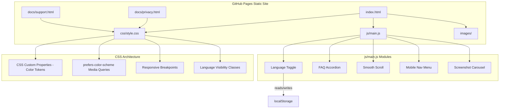

# Design Document: JT (旅) Landing Page

## Overview

The JT (旅) — Japan Travel Planner landing page is a static, single-page website built with vanilla HTML, CSS, and JavaScript. It is hosted on GitHub Pages and serves as the promotional page for the JT Planner iOS app. The page is bilingual (English/Thai), supports light/dark mode via `prefers-color-scheme`, and follows a mobile-first responsive design with an Apple-inspired aesthetic and subtle Japanese design touches (Seigaiha wave patterns).

The implementation uses no build tools or frameworks — just three files (`index.html`, `css/style.css`, `js/main.js`) plus two separate pages (`docs/privacy.html`, `docs/support.html`). All bilingual content is embedded in the HTML with visibility toggled via CSS classes. Images are lazy-loaded and the total page weight (excluding images) stays under 500KB.

## Architecture



### Design Decisions

1. **No build tools**: The site is simple enough that a build step adds complexity without benefit. CSS and JS are separate files for maintainability but could be inlined for a single-file deployment.
2. **Both languages in HTML**: Rather than fetching translations from JSON, both EN and TH text live in the markup. The language toggle adds/removes a `.lang-th` class on `<html>`, and CSS rules hide/show the appropriate `<span lang="en">` / `<span lang="th">` elements. This ensures content is available to search engines and works without JavaScript.
3. **CSS custom properties for theming**: All color tokens are defined as CSS custom properties on `:root` and overridden inside a `@media (prefers-color-scheme: dark)` block. This keeps theming centralized and easy to maintain.
4. **Seigaiha wave pattern via CSS**: The decorative wave pattern is generated using a CSS background with SVG data URI, avoiding an extra network request.
5. **No hero-mockup.png**: The existing assets include individual screenshots and an iPhone frame (`apple-iphone-17-pro-max-frame.png`). The hero section will composite the frame image with a screenshot using CSS positioning, or use a screenshot directly with rounded corners.

## Components and Interfaces

### File Structure

```
JT-TabiLanding/
├── index.html              # Main landing page
├── css/
│   └── style.css           # All styles (theming, responsive, components)
├── js/
│   └── main.js             # Language toggle, FAQ accordion, smooth scroll, mobile nav
├── docs/
│   ├── privacy.html        # Privacy policy page
│   └── support.html        # Support page
└── images/
    ├── app-icon.png
    ├── apple-iphone-17-pro-max-frame.png
    ├── screenshot-explore.png
    ├── screenshot-itinerary.png
    ├── screenshot-jr-pass.png
    ├── screenshot-budget.png
    ├── screenshot-export.png
    └── screenshot-watch.png
```

### HTML Structure (index.html)

The page uses semantic HTML5 elements:

```
<html lang="en">
  <head>        — Meta tags, SEO, Open Graph, JSON-LD, CSS link
  <body>
    <header>    — Sticky navigation bar with logo, nav links, language toggle, CTA
    <main>
      <section id="hero">          — Headline, subheadline, CTA, mockup image
      <section id="features">      — 11 feature cards in responsive grid
      <section id="how-it-works">  — 3-step flow with icons and descriptions
      <section id="screenshots">   — Horizontal scrollable screenshot gallery
      <section id="special">       — 2 highlight cards
      <section id="perfect-for">   — Traveler type pills/tags
      <section id="faq">           — Accordion Q&A
      <section id="download">      — CTA with App Store badge
    </main>
    <footer>    — App name, links, copyright, disclaimer
  </body>
</html>
```

### Bilingual Text Pattern

Every piece of visible text uses this pattern:

```html
<h2>
  <span lang="en">Plan Your Trip in 3 Steps</span>
  <span lang="th">วางแผนทริปใน 3 ขั้นตอน</span>
</h2>
```

CSS controls visibility:

```css
/* Default: show English, hide Thai */
[lang="th"] { display: none; }
[lang="en"] { display: inline; }

/* When .lang-th is on <html>: show Thai, hide English */
html.lang-th [lang="th"] { display: inline; }
html.lang-th [lang="en"] { display: none; }
```

### CSS Architecture (style.css)

**Custom Properties (Color Tokens)**:

```css
:root {
  --color-primary: #2196F3;
  --color-soft-indigo: #4B5CC4;
  --color-wave-blue: #7BA3D1;
  --color-sand: #E8DCC4;
  --color-bg: #FFFFFF;
  --color-surface: #F5F5F7;
  --color-text-primary: #1D1D1F;
  --color-text-secondary: #86868B;
}

@media (prefers-color-scheme: dark) {
  :root {
    --color-primary: #42ADFF;
    --color-bg: #1C1C1E;
    --color-surface: #2C2C2E;
    --color-text-primary: #F5F5F7;
  }
}
```

**Responsive Breakpoints**:

```css
/* Mobile-first base styles (< 768px): single column */
/* Tablet (768px–1024px): 2-column grid */
@media (min-width: 768px) { ... }
/* Desktop (> 1024px): 3-column grid */
@media (min-width: 1024px) { ... }
```

**Component Styles**: Navigation bar (sticky, backdrop blur), hero section, feature cards (grid), how-it-works steps, screenshot carousel (horizontal scroll with snap), FAQ accordion, pills/tags, footer, Seigaiha wave background pattern.

### JavaScript Components (main.js)

All JS is vanilla, no dependencies.

**1. Language Toggle**

```
function: initLanguageToggle()
- Reads localStorage key "jt-lang" on page load
- If "th", adds class "lang-th" to <html>; otherwise defaults to English
- On toggle click: toggles "lang-th" class, updates localStorage, updates toggle button text
```

**2. FAQ Accordion**

```
function: initFaqAccordion()
- Attaches click handlers to all .faq-question elements
- On click: toggles "active" class on parent .faq-item, which controls max-height of .faq-answer
- Supports keyboard: Enter and Space trigger toggle
- Uses aria-expanded and aria-controls for accessibility
```

**3. Smooth Scroll**

```
function: initSmoothScroll()
- Intercepts clicks on anchor links (href="#section-id")
- Calls element.scrollIntoView({ behavior: 'smooth' })
- Offsets for sticky nav height
```

**4. Mobile Navigation**

```
function: initMobileNav()
- Hamburger button toggles visibility of nav links on mobile
- Closes menu when a nav link is clicked
- Uses aria-expanded on the hamburger button
```

**5. Screenshot Carousel**

```
function: initScreenshotCarousel()
- Enables horizontal scroll with CSS scroll-snap
- Optional: adds left/right arrow buttons for desktop navigation
```

### Privacy and Support Pages

`docs/privacy.html` and `docs/support.html` are standalone HTML pages that share `css/style.css` (referenced via `../css/style.css`). They have a simple layout: a header with the app name and a "Back to Home" link, the content body, and a minimal footer. They inherit the same theming (light/dark) and language toggle is not needed on these pages (content is English-only as specified in the brief).

## Data Models

This is a static site with no backend or persistent data models. The only data stored is:

### localStorage Schema

| Key | Type | Values | Purpose |
|-----|------|--------|---------|
| `jt-lang` | string | `"en"` or `"th"` | Stores the visitor's language preference |

### JSON-LD Structured Data

```json
{
  "@context": "https://schema.org",
  "@type": "SoftwareApplication",
  "name": "JT (旅) — Japan Travel Planner",
  "operatingSystem": "iOS",
  "applicationCategory": "TravelApplication",
  "offers": {
    "@type": "Offer",
    "price": "0",
    "priceCurrency": "USD"
  },
  "description": "Plan your perfect Japan trip with JT Planner. Browse 1000+ places, create detailed itineraries, get JR Pass recommendations, and access everything offline.",
  "url": "https://jtplanner357.github.io/JT-TabiLanding/",
  "downloadUrl": "https://apps.apple.com/app/jt-planner/id0000000000"
}
```

### Open Graph Meta Tags

```html
<meta property="og:title" content="JT (旅) — Japan Travel Planner">
<meta property="og:description" content="Plan your perfect Japan trip...">
<meta property="og:image" content="https://jtplanner357.github.io/JT-TabiLanding/images/app-icon.png">
<meta property="og:url" content="https://jtplanner357.github.io/JT-TabiLanding/">
<meta property="og:type" content="website">
```

### Content Data

All bilingual content (feature cards, FAQ items, how-it-works steps, etc.) is hardcoded in the HTML. The content is defined in the brief and does not change at runtime. There are 11 feature cards, 3 how-it-works steps, 2 special highlight cards, 6 traveler type tags, and 5 FAQ items.


## Correctness Properties

*A property is a characteristic or behavior that should hold true across all valid executions of a system — essentially, a formal statement about what the system should do. Properties serve as the bridge between human-readable specifications and machine-verifiable correctness guarantees.*

The following properties are derived from the acceptance criteria prework analysis. Many acceptance criteria for this static site are structural examples (verifying specific HTML elements exist) rather than universal properties. The properties below capture the criteria that generalize across collections of elements.

### Property 1: Bilingual markup completeness

*For any* visible text container in the Landing_Page (headings, paragraphs, button labels, card titles, card descriptions, FAQ questions, FAQ answers), the container SHALL have both a child element with `lang="en"` and a child element with `lang="th"`, and toggling the `.lang-th` class on `<html>` SHALL swap which child is visible.

**Validates: Requirements 1.2, 1.5, 1.6**

### Property 2: Language preference round-trip

*For any* language value ("en" or "th"), storing it via the language toggle function and then initializing the page SHALL restore the same language state. Specifically: `setLanguage(lang) → readLocalStorage("jt-lang")` returns `lang`, and `setLocalStorage("jt-lang", lang) → initLanguage()` applies the corresponding class.

**Validates: Requirements 1.3, 1.4**

### Property 3: Feature cards structural completeness

*For any* feature card element in the Feature_Grid, the card SHALL contain an emoji icon element, a title element with both `lang="en"` and `lang="th"` children, and a description element with both `lang="en"` and `lang="th"` children. The total count of feature cards SHALL be exactly 11.

**Validates: Requirements 5.1**

### Property 4: Image lazy-loading

*For any* `` element in the Landing_Page that is below the hero section (i.e., not the first visible image), the element SHALL have the attribute `loading="lazy"`.

**Validates: Requirements 7.3, 16.2**

### Property 5: FAQ accordion toggle round-trip

*For any* FAQ item, clicking (or pressing Enter/Space on) the question element twice SHALL return the item to its original collapsed state. Formally: for all FAQ items, `toggle(toggle(state)) === state`.

**Validates: Requirements 10.2, 10.3, 10.4**

### Property 6: Heading hierarchy validity

*For any* sequence of heading elements (h1–h6) in the Landing_Page document order, no heading SHALL skip more than one level (e.g., h1 followed by h3 is invalid; h1 followed by h2 is valid).

**Validates: Requirements 18.2**

### Property 7: Image alt text completeness

*For any* `` element in the Landing_Page, the `alt` attribute SHALL be present and contain a non-empty string.

**Validates: Requirements 18.3**

### Property 8: Color contrast compliance

*For any* text-color/background-color pair defined in the CSS custom properties (light mode and dark mode), the WCAG contrast ratio SHALL be at least 4.5:1.

**Validates: Requirements 2.5**

## Error Handling

Since this is a static site with minimal JavaScript, error handling is straightforward:

### JavaScript Errors

- **localStorage unavailable** (e.g., private browsing): The language toggle function SHALL wrap localStorage access in a try/catch. If localStorage is unavailable, the page defaults to English and the toggle still works for the current session (using an in-memory variable).
- **Missing images**: All `` elements use descriptive `alt` text so content is understandable even if images fail to load.
- **JavaScript disabled**: Both language versions are in the HTML. Without JS, the page shows English content (the default). The FAQ answers should be visible by default in `<noscript>` scenarios or use `<details>/<summary>` as a progressive enhancement fallback.

### CSS Fallbacks

- **prefers-color-scheme unsupported**: The light mode is the default, so browsers that don't support the media query get light mode.
- **CSS custom properties unsupported**: Extremely old browsers may not render custom properties. This is acceptable given the target audience (iOS app users with modern browsers).

### Content Errors

- **App Store link placeholder**: The placeholder URL `https://apps.apple.com/app/jt-planner/id0000000000` is used until the real link is available. A single find-and-replace updates all instances.

## Testing Strategy

### Unit Tests (Example-Based)

Unit tests verify specific structural and content requirements. Use a DOM testing approach (e.g., jsdom with a test runner like Vitest).

Key test cases:
- **SEO meta tags**: Verify title, meta description, OG tags, and JSON-LD exist with correct values (Requirements 17.1–17.5)
- **Navigation structure**: Verify nav contains correct links, logo, toggle, and CTA (Requirements 3.2–3.6)
- **Hero content**: Verify headline, subheadline, CTA, and mockup image exist (Requirements 4.1–4.4)
- **Section existence**: Verify all required sections exist with correct IDs (Requirements 6–12)
- **Footer content**: Verify links, copyright, disclaimer (Requirements 12.1–12.4)
- **Privacy and Support pages**: Verify files exist and contain required content (Requirements 13, 14)
- **Semantic HTML**: Verify header, nav, main, section, footer elements (Requirement 18.1)
- **Responsive CSS**: Verify media queries at 768px and 1024px breakpoints exist (Requirement 15.2)
- **Page weight**: Verify combined HTML+CSS+JS < 500KB (Requirement 16.1)

### Property-Based Tests

Use **fast-check** as the property-based testing library with Vitest as the test runner. Each property test runs a minimum of 100 iterations.

| Property | Test Description | Tag |
|----------|-----------------|-----|
| Property 1 | Generate random bilingual text containers, verify both lang spans exist and toggle visibility works | Feature: jt-tabi-landing-page, Property 1: Bilingual markup completeness |
| Property 2 | Generate random language values, verify localStorage round-trip | Feature: jt-tabi-landing-page, Property 2: Language preference round-trip |
| Property 3 | Iterate over all feature cards, verify structural completeness | Feature: jt-tabi-landing-page, Property 3: Feature cards structural completeness |
| Property 4 | Iterate over all below-fold images, verify lazy-loading attribute | Feature: jt-tabi-landing-page, Property 4: Image lazy-loading |
| Property 5 | Generate random FAQ item indices and toggle sequences, verify idempotent round-trip | Feature: jt-tabi-landing-page, Property 5: FAQ accordion toggle round-trip |
| Property 6 | Parse all headings, verify no level is skipped by more than 1 | Feature: jt-tabi-landing-page, Property 6: Heading hierarchy validity |
| Property 7 | Iterate over all img elements, verify non-empty alt attribute | Feature: jt-tabi-landing-page, Property 7: Image alt text completeness |
| Property 8 | Generate all text/background color pairs from CSS tokens, compute WCAG contrast ratio, verify >= 4.5 | Feature: jt-tabi-landing-page, Property 8: Color contrast compliance |

### Test Configuration

- **Test runner**: Vitest
- **Property-based testing library**: fast-check
- **DOM environment**: jsdom (via Vitest's jsdom environment)
- **Minimum iterations**: 100 per property test
- **Test file location**: `tests/` directory
